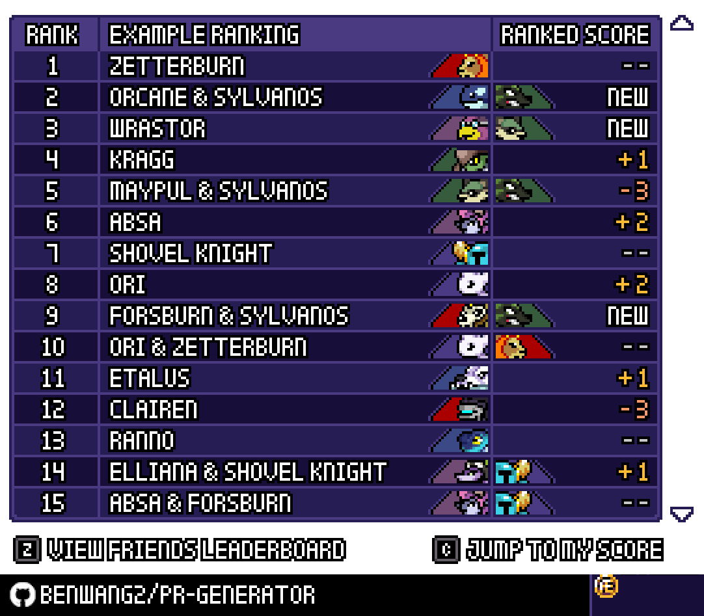

# RoA-Leaderboard-Generator
A webpage that generates a leaderboard using the font and graphics from the video game [Rivals of Aether](https://rivalsofaether.com/). Try it out [here](https://benwang2.github.io/RoA-Ranking-Generator/)!

# How does it work?
A template image is pasted onto the canvas, which serves as the backdrop.

The simplistic Rivals of Aether font is generated using matrix that including data that indicate whether a pixels are transparent, black, or white and then drawn onto the canvas.

The "main" and "secondary" images are cropped and drawn from their corresponding image files.
